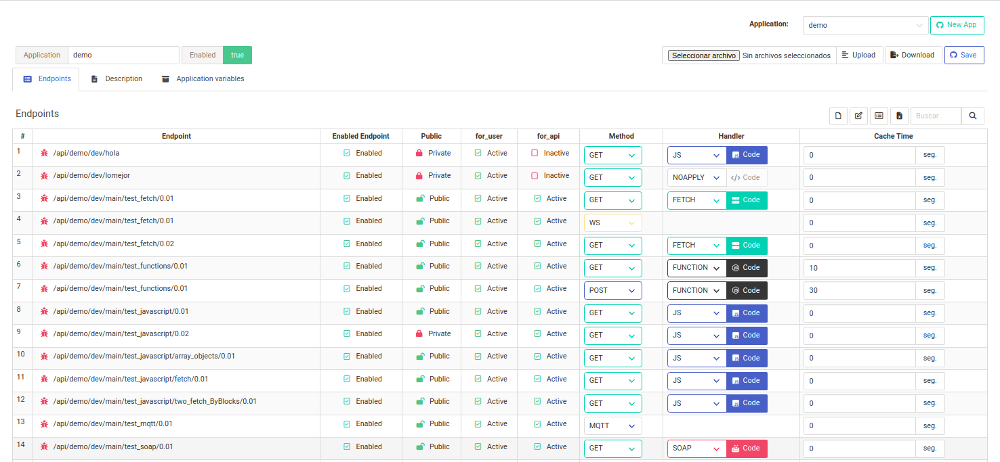

# API Server 

Integrated HTTP, Websocket and MQTT server, to quickly create rest services.

Designed to create APIs **quickly** and **easily**, which connect to the most used SQL databases. It uses ExpressJS for the Backend and Svelte for the Frontend as a base. 

It also has the ability to connect to SOAP services and convert them to REST services. 

It is managed mainly from a Web interface from where the APIs are created.

At the moment we have the following handlers available:

- SQL
- SOAP
- Javascript (Javascript code created directly in the frontend)
- Functions (Javascript code created directly in the backend)
- Fetch (Makes calls to other REST services)  

# Server features

The server has some features that will allow you to implement a REST server quickly from a Web interface.

The main ones are:

- HTTP server with expressjs
- Websocket server on the same port
- MQTT server (aedes) on the same port
- Authentication by user and password or JWT (TODO)
- Fast implementation of REST service for databases (PostgreSQL, SQLite, MySQL, MS SQL Server)
- Proxy for REST services using FETCH
- Proxy for SOAP services, can convert them into REST services
- Ability to execute javascript code
- Execution of custom Javascript Functions
- Three development areas (Development, Quality, Production)
- The configuration can be saved in any of the supported databases.

  

# Documentation

The documentation can be found at the following [Documentation File](https://github.com/edwinspire/libapiserver/blob/main/docs/README.md).

Or if you want the project ready to use you can visit the following project that uses this library as a base: https://github.com/edwinspire/OpenFusionAPI

#
**It is a project under construction that has served me a lot as a base for other personal projects, and I am sure that it can be useful to someone else.**
